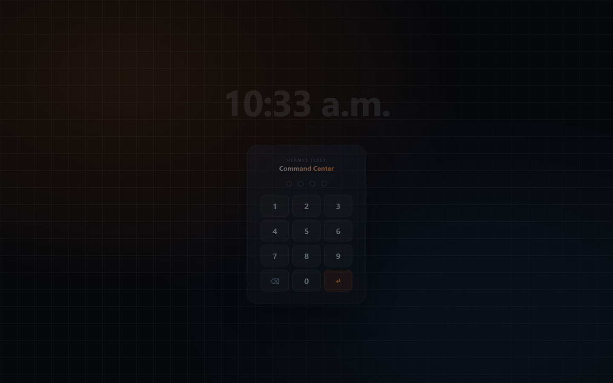
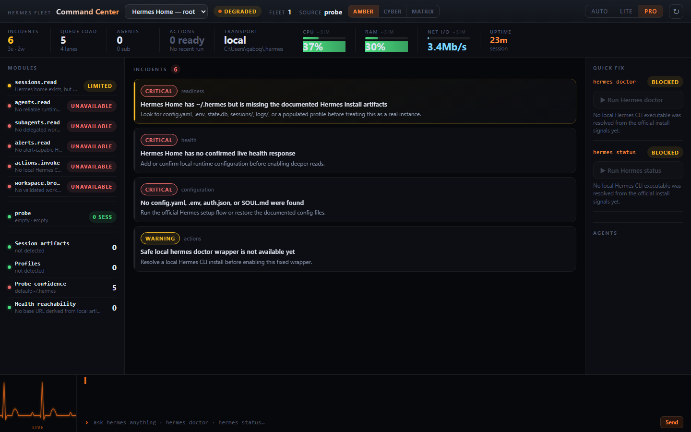
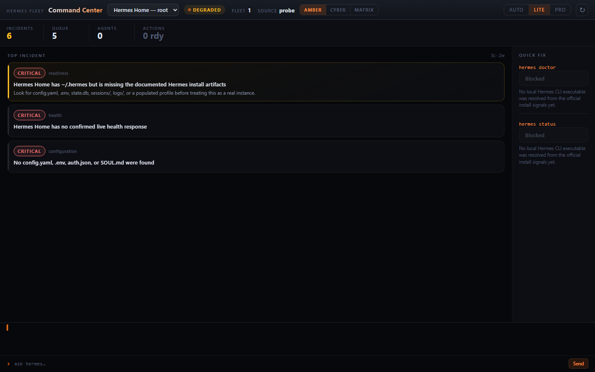
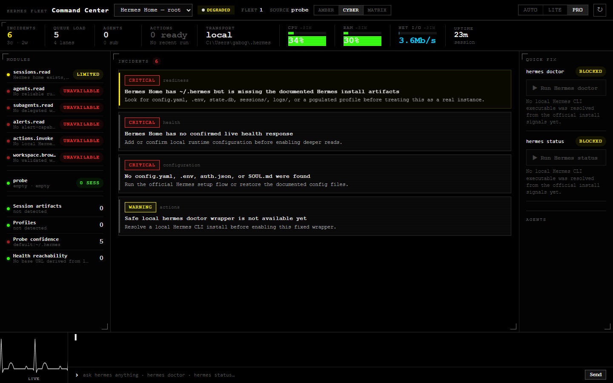
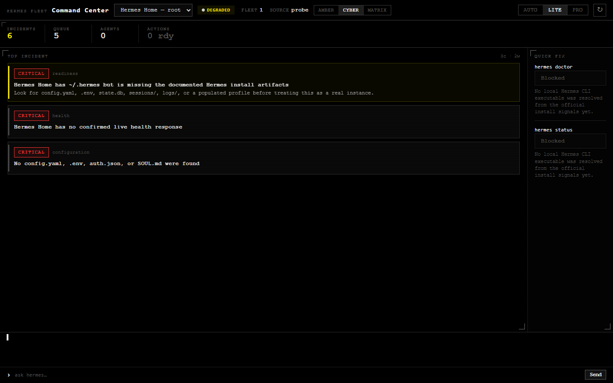
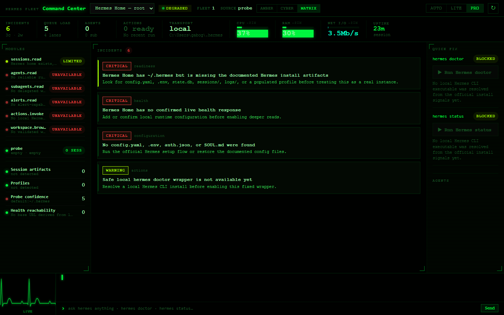
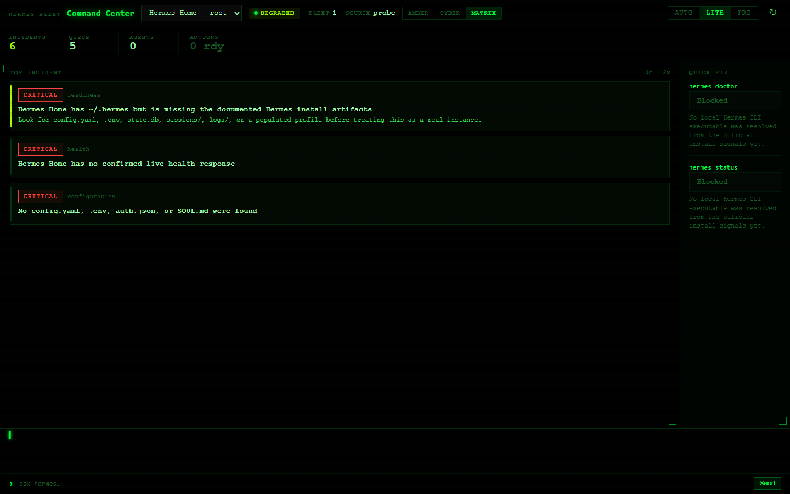

# Hermes Command Center

A **production monitoring dashboard** for [Hermes Agent](https://github.com/nousresearch/hermes-agent) instances. Not a chat UI — a diagnostic cockpit.

> **Purpose:** Answer 5 ops questions at a glance:
> ¿Cómo está? · ¿Algo falla? · ¿Algo a vigilar? · ¿Chequeo general? · ¿Reparación rápida?

---

## Screenshots

### PIN Gate — Lock screen



### AMBER — Default ops theme

| Pro | Lite |
|-----|------|
|  |  |

### CYBER — Hacker terminal

| Pro | Lite |
|-----|------|
|  |  |

### MATRIX — Green phosphor

| Pro | Lite |
|-----|------|
|  |  |

---

## What this is (and what it isn't)

| This dashboard | hermes-webui |
|----------------|--------------|
| Monitor health, diagnose issues, react fast | Use Hermes to do work |
| Ops cockpit — glance and act | Full chat UI, workspace browser |
| No message content, no file browser | Full conversation history |
| Chat = diagnostic tool ("are you OK?") | Chat = primary interface |

---

## Features

### Single-screen cockpit
Everything visible without scrolling — vitals strip, 3-column grid, EKG heartbeat, chat terminal — all in 100vh.

### Profile monitoring
Reads `~/.hermes/profiles/*` directly. For each profile:
- Active model + provider (from `config.yaml`)
- Session count + last activity time
- Cron jobs — enabled/total
- Memory file count

### Live system metrics
CPU · RAM · Net I/O · Uptime — real data from `/proc/stat`, `/proc/meminfo`, `/proc/net/dev`. Polled every 2s. Falls back to simulated random-walk on non-Linux (dev mode), labeled `~sim`.

### Skin engine
Three skins, persisted to `localStorage`, switchable from the top bar at any time.

### PIN gate
Fullscreen lock screen with clock. Default PIN: `1234` (change in `src/components/PinGate.tsx`).

### Diagnostic chat
SSE-streamed `hermes chat -q` — interrogate the live agent to diagnose issues in real time.

### Quick Fix actions
Run `hermes doctor` and `hermes status` directly from the dashboard with one click.

---

## Skins

| Skin | Style | Accent |
|------|-------|--------|
| **AMBER** | Deep navy, radial glow, rounded cards | `#e86a1a` orange |
| **CYBER** | Pure black, sharp pixel borders, scanlines | `#ffffff` white |
| **MATRIX** | Pure black, phosphor glow | `#00ff41` green |

### Adding a new skin

**1. Register** in `src/skins/registry.ts`:
```ts
{ id: 'my-skin', label: 'MY SKIN', description: 'Description' }
```

**2. Add CSS overrides** in `src/styles/global.css`:
```css
[data-skin="my-skin"] {
  --accent:    #your-color;
  --surface-0: #000;
  /* override any token */
  font-family: 'Your Font', monospace;
}
```

The skin switcher picks it up automatically — no component changes needed.

---

## Surface modes

| Mode | Description | When |
|------|-------------|------|
| **Pro** | Full cockpit: vitals, 3-column grid, EKG, chat | Wide display, fine pointer |
| **Lite** | Minimal: top incidents + quick fix only | Constrained viewport, touch, e-ink |
| **Auto** | Picks based on viewport, color depth, hover | Default |

---

## Architecture

```
src/
  app/App.tsx               ← fleet loader, surface mode, skin switcher
  modes/
    ProMode.tsx             ← full cockpit layout + profiles section
    LiteMode.tsx            ← minimal layout
  components/
    PinGate.tsx             ← lock screen with clock + numpad
  hooks/
    useLiveMetrics.ts       ← simulated CPU/RAM/Net/Uptime (2s interval)
    useProfiles.ts          ← fetches /api/profiles every 30s
    useSkin.ts              ← applies data-skin to <html>, persists to localStorage
  skins/
    registry.ts             ← skin definitions (id, label, description)
  styles/
    global.css              ← all CSS + [data-skin="X"] overrides
  adapters/
    probeAdapter.ts         ← fetches /api/fleet, /api/actions/*

server/probe/
  fleetApiPlugin.mjs        ← Vite plugin — registers all /api/* routes
  fleetProbe.mjs            ← discovers Hermes instances via filesystem scan
  profileProbe.mjs          ← reads profiles, sessions, cron jobs, memory
  doctorAction.mjs          ← runs hermes doctor / hermes status as subprocesses
  chatAction.mjs            ← streams hermes chat -q via SSE (boilerplate filtered)
```

### Data flow

```
Browser → /api/fleet         → fleetProbe    → ~/.hermes filesystem scan
        → /api/profiles      → profileProbe  → ~/.hermes/profiles/* scan
        → /api/actions/doctor → doctorAction → spawn: hermes doctor
        → /api/actions/status → doctorAction → spawn: hermes status
        → /api/chat (SSE)    → chatAction    → spawn: hermes chat -q
```

All data comes from the **local filesystem** and **Hermes CLI subprocesses**. No remote API calls, no database writes.

### Profile data sources

| Signal | File |
|--------|------|
| Active profile | `~/.hermes/active_profile` |
| Model / provider | `~/.hermes/profiles/{name}/config.yaml` |
| Session count | `~/.hermes/profiles/{name}/sessions/` (file count) |
| Last activity | newest session file mtime |
| Cron jobs | `~/.hermes/profiles/{name}/cron/` |
| Memory files | `~/.hermes/profiles/{name}/memories/` |
| Skills | `~/.hermes/profiles/{name}/skills/` `.md`/`.yaml` count |

---

## Setup

### 1. Set your PIN (required before first deploy)

The access PIN is verified **server-side** — it never exists in the browser bundle. Set it as an environment variable before building:

**systemd (production recommended):**
```ini
# /etc/systemd/system/hcc.service
[Service]
Environment=HCC_PIN=your_pin_here
ExecStart=/usr/local/bin/node .../vite preview --host 0.0.0.0 --port 4173
```

```bash
systemctl daemon-reload && systemctl restart hcc
```

**Dev / quick test:**
```bash
HCC_PIN=5678 npm run dev
```

If `HCC_PIN` is not set, the server falls back to `1234` — **never leave this unset in production**.

### 2. Install and run

```bash
npm install
npm run dev     # Vite dev server + probe routes on :5173
```

### 3. Production build

```bash
npm run build
systemctl enable --now hcc
```

### Server requirements

- Node.js ≥ 18
- Linux (for real `/proc` metrics — falls back to simulated on other platforms)
- Hermes Agent installed at `~/.hermes/` (or `$HERMES_HOME`)
- Hermes binary resolvable at `~/.hermes/hermes-agent/venv/bin/hermes`

---

## API reference

All endpoints served on the same port as the dashboard:

| Endpoint | Method | Description |
|----------|--------|-------------|
| `/api/auth` | POST `{pin}` | Verify PIN server-side — PIN never in bundle |
| `/api/probe/health` | GET | Probe liveness + instance count |
| `/api/fleet` | GET | Full fleet snapshot (instances, capabilities, incidents) |
| `/api/profiles` | GET | Active profile + all profiles with ops signals |
| `/api/system` | GET | Real CPU/RAM/Net/Uptime from `/proc` |
| `/api/actions/doctor` | POST `{instanceId}` | Run `hermes doctor` |
| `/api/actions/status` | POST `{instanceId}` | Run `hermes status` |
| `/api/chat` | POST `{instanceId, message}` | SSE stream from `hermes chat -q` |

---

## Known limitations

| Item | Status |
|------|--------|
| CPU/RAM metrics | Real from `/proc` on Linux. Simulated random-walk on dev (Windows/Mac). |
| Chat continuity | Each message spawns a new process. `--continue` session flag available but not exposed in UI. |
| Multi-Hermes | Only monitors the default `~/.hermes` instance + its profiles. Other VPS instances require separate deployments. |

---

## Pro/Lite selection contract

Auto mode selects Lite when:
- Color depth ≤ 8-bit (e-ink / monochrome), OR
- Two or more of: viewport < 960px wide / < 720px tall, no hover, no fine pointer, `prefers-reduced-motion`

Otherwise Pro is selected. The `Auto / Lite / Pro` switcher in the top bar always overrides.

---

## License

MIT
